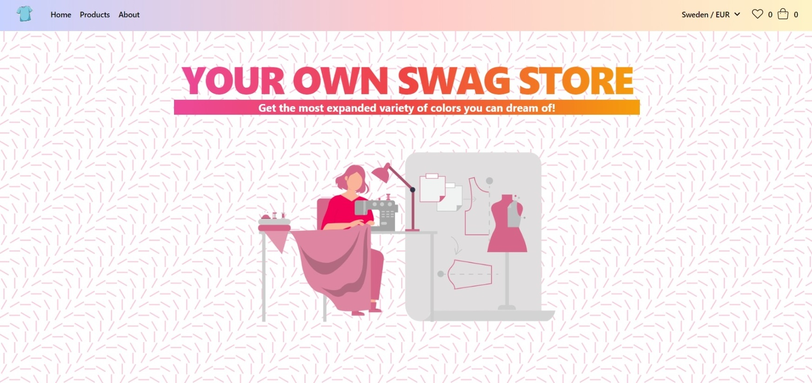

<h1 align="center" style="font-weight: bold;">Your Own Swag Store</h1>

The best looking swag store powered by medusa.js!

---

<strong><a href="#Installation">Install</a></strong>
|
<strong><a href="#Features">Features</a></strong>

---

</img>

## **Installation**

1\. Clone the project with `https://github.com/mananchawla2005/medusa-hackathon.git `  3\. First we would import the provided sql database! create a new postgres database named `nuxt-store` and then run the command `psql -U postgres -h localhost nuxt-store < postgresbackup.sql `   4\. Then install medusa cli with `npm install @medusajs/medusa-cli -g`  5\. Switch over to the server directory, change the connection parameters in the `medusa.config.js` as well as environment variables, run the migrations with `medusa migrations run` and start the server with `medusa develop`  6\. Your server should be running at `https://localhost:9000`  7\. Move to the nuxt-store branch where after installing the packages with `yarn` and setting the enviornment variables..., start the server with `yarn dev` 
  8\. Alternatively execute `yarn build && yarn generate` followed by `yarn start` to see the static version of the built website!

## **Features**
- Awesome UX/UI swag store to have a mesmering experience
- Wishlist functionality fully supported
- Fast response time as it is a static website
- Payments handled by stripe
- Powered by awesome library medusa.js and the community as an open source shoppify alternative
- **Dynamic change of colors on any product in the store**

## **💕Contributing**

- The project is open for contributions. You can make an issue or assign yourselves one and then can start working on it. The project uses node.js for serving the files in combination with ejs as the templating engine. While making a pull request, make sure to pr to the dev branch rather than the master branch.

## Thanks to all Contributors

# **Happy Hacking!**
If you liked this project, please leave a 🌟
